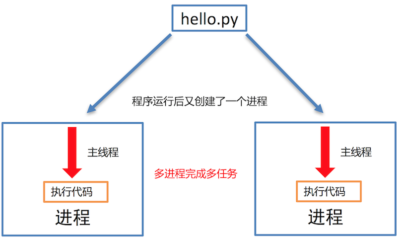

# 1.多任务介绍

### . 提问

**利用现学知识能够让两个函数或者方法同时执行吗?**

不能，因为之前所写的程序都是**单任务的**，也就是说一个函数或者方法执行完成另外一个函数或者方法才能执行，要想实现这种操作就需要使用**多任务**。
多任务的最大好处是**充分利用CPU资源，提高程序的执行效率**。

### 2. 多任务的概念

多任务是指在**同一时间内**执行**多个任务**，例如: 现在电脑安装的操作系统都是多任务操作系统，可以同时运行着多个软件。

**多任务效果图:**


### 3. 多任务的执行方式

- 并发
- 并行

**并发:**

在一段时间内**交替**去执行任务。

**例如:**

对于单核cpu处理多任务,操作系统轮流**让各个软件交替执行**，假如:软件1执行0.01秒，切换到软件2，软件2执行0.01秒，再切换到软件3，执行0.01秒……这样反复执行下去。表面上看，每个软件都是交替执行的，但是，由于CPU的执行速度实在是太快了，我们感觉就像这些软件都在同时执行一样，这里需要注意单核cpu是并发的执行多任务的。

**并行:**

对于多核cpu处理多任务，操作系统会给cpu的每个内核安排一个执行的软件，**多个内核是真正的一起执行软件**。这里需要注意**多核cpu是并行的执行多任务，始终有多个软件一起执行**。

### 4. 小结

- 使用多任务就能充分利用CPU资源，提高程序的执行效率，让你的程序具备处理多个任务的能力。
- 多任务执行方式有两种方式：**并发**和**并行**，这里并行才是多个任务真正意义一起执行。

**学习目标**

- 能够知道进程的作用

------

# 2.进程

### 1. 进程的介绍

在Python程序中，想要实现多任务可以使用进程来完成，进程是实现多任务的一种方式。

### 2. 进程的概念

一个正在运行的程序或者软件就是一个进程，**它是操作系统进行资源分配的基本单位**，也就是说每启动一个进程，操作系统都会给其分配一定的运行资源(内存资源)保证进程的运行。

比如:现实生活中的公司可以理解成是一个进程，公司提供办公资源(电脑、办公桌椅等)，真正干活的是员工，员工可以理解成线程。

**注意:**

**一个程序运行后至少有一个进程，一个进程默认有一个线程**，进程里面可以创建多个线程，**线程是依附在进程里面的，没有进程就没有线程**。

### 3. 进程的作用

**单进程效果图:**

**多进程效果图:****说明:**

多进程可以完成多任务，每个进程就好比一家独立的公司，每个公司都各自在运营，每个进程也各自在运行，执行各自的任务。

### 4. 小结

- 进程是操作系统进行资源分配的基本单位。
- 进程是Python程序中实现多任务的一种方式


# 3.多进程的使用

**学习目标**

- 能够知道进程的作用

------

### 1. 进程的介绍

在Python程序中，想要实现多任务可以使用进程来完成，进程是实现多任务的一种方式。

### 2. 进程的概念

一个正在运行的程序或者软件就是一个进程，**它是操作系统进行资源分配的基本单位**，也就是说每启动一个进程，操作系统都会给其分配一定的运行资源(内存资源)保证进程的运行。

比如:现实生活中的公司可以理解成是一个进程，公司提供办公资源(电脑、办公桌椅等)，真正干活的是员工，员工可以理解成线程。

**注意:**

**一个程序运行后至少有一个进程，一个进程默认有一个线程**，进程里面可以创建多个线程，**线程是依附在进程里面的，没有进程就没有线程**。

### 3. 进程的作用

**单进程效果图:**

```python
import multiprocessing
import time


# 跳舞任务
def dance():
    for i in range(5):
        print("跳舞中...")
        time.sleep(0.2)


# 唱歌任务
def sing():
    for i in range(5):
        print("唱歌中...")
        time.sleep(0.2)

if __name__ == '__main__':
    # 创建跳舞的子进程
    # group: 表示进程组，目前只能使用None
    # target: 表示执行的目标任务名(函数名、方法名)
    # name: 进程名称, 默认是Process-1, .....
    dance_process = multiprocessing.Process(target=dance, name="myprocess1")
    sing_process = multiprocessing.Process(target=sing)

    # 启动子进程执行对应的任务
    dance_process.start()
    sing_process.start()
```

**执行结果:**

```python
唱歌中...
跳舞中...
唱歌中...
跳舞中...
唱歌中...
跳舞中...
唱歌中...
跳舞中...
唱歌中...
跳舞中...
```

### 4. 小结

1. 导入进程包
   - import multiprocessing
2. 创建子进程并指定执行的任务
   - sub_process = multiprocessing.Process (target=任务名)
3. 启动进程执行任务
   - sub_process.start()


# 5.进程执行带有参数的任务

### 1. 进程执行带有参数的任务的介绍

前面我们使用进程执行的任务是没有参数的，假如我们使用进程执行的任务带有参数，如何给函数传参呢?

Process类执行任务并给任务传参数有两种方式:

- args 表示以元组的方式给执行任务传参
- kwargs 表示以字典方式给执行任务传参

### 2. args参数的使用

**示例代码:**

```python
import multiprocessing
import time


# 带有参数的任务
def task(count):
    for i in range(count):
        print("任务执行中..")
        time.sleep(0.2)
    else:
        print("任务执行完成")


if __name__ == '__main__':
    # 创建子进程
    # args: 以元组的方式给任务传入参数
    sub_process = multiprocessing.Process(target=task, args=(5,))
    sub_process.start()
```

执行结果

```
任务执行中..
任务执行中..
任务执行中..
任务执行中..
任务执行中..
任务执行完成
```

### 3. kwargs参数的使用

**示例代码:**

```python
import multiprocessing
import time


# 带有参数的任务
def task(count):
    for i in range(count):
        print("任务执行中..")
        time.sleep(0.2)
    else:
        print("任务执行完成")


if __name__ == '__main__':
    # 创建子进程

    # kwargs: 表示以字典方式传入参数
    sub_process = multiprocessing.Process(target=task, kwargs={"count": 3})
    sub_process.start()
```

执行结果

```
任务执行中..
任务执行中..
任务执行中..
任务执行完成
```

### 4. 小结

- 进程执行任务并传参有两种方式:
  - **元组方式传参(args)**: 元组方式传参一定要和参数的顺序保持一致。
  - **字典方式传参(kwargs)**: 字典方式传参字典中的key一定要和参数名保持一致。


# 6.进程的注意点

### 1. 进程的注意点介绍

1. 进程之间不共享全局变量
2. 主进程会等待所有的子进程执行结束再结束

### 2. 进程之间不共享全局变量

```python
import multiprocessing
import time

# 定义全局变量
g_list = list()


# 添加数据的任务
def add_data():
    for i in range(5):
        g_list.append(i)
        print("add:", i)
        time.sleep(0.2)

    # 代码执行到此，说明数据添加完成
    print("add_data:", g_list)


def read_data():
    print("read_data", g_list)


if __name__ == '__main__':
    # 创建添加数据的子进程
    add_data_process = multiprocessing.Process(target=add_data)
    # 创建读取数据的子进程
    read_data_process = multiprocessing.Process(target=read_data)

    # 启动子进程执行对应的任务
    add_data_process.start()
    # 主进程等待添加数据的子进程执行完成以后程序再继续往下执行，读取数据
    add_data_process.join()
    read_data_process.start()

    print("main:", g_list)

    # 总结: 多进程之间不共享全局变量
```

执行结果

```
add: 0
add: 1
add: 2
add: 3
add: 4
add_data: [0, 1, 2, 3, 4]
main: []
read_data []
```

**进程之间不共享全局变量的解释效果图:**

### 3. 进程之间不共享全局变量的小结

- 创建子进程会对主进程资源进行拷贝，也就是说子进程是主进程的一个副本，好比是一对双胞胎，之所以进程之间不共享全局变量，是因为操作的不是同一个进程里面的全局变量，只不过不同进程里面的全局变量名字相同而已。

### 4. 主进程会等待所有的子进程执行结束再结束

假如我们现在创建一个子进程，这个子进程执行完大概需要2秒钟，现在让主进程执行0.5秒钟就退出程序，查看一下执行结果，示例代码如下:

```python
import multiprocessing
import time


# 定义进程所需要执行的任务
def task():
    for i in range(10):
        print("任务执行中...")
        time.sleep(0.2)

if __name__ == '__main__':
    # 创建子进程
    sub_process = multiprocessing.Process(target=task)
    sub_process.start()

    # 主进程延时0.5秒钟
    time.sleep(0.5)
    print("over")
    exit()

    # 总结： 主进程会等待所有的子进程执行完成以后程序再退出
```

执行结果

```
任务执行中...
任务执行中...
任务执行中...
over
任务执行中...
任务执行中...
任务执行中...
任务执行中...
任务执行中...
任务执行中...
任务执行中...
```

**说明:**

通过上面代码的执行结果，我们可以得知: **主进程会等待所有的子进程执行结束再结束**

假如我们就让主进程执行0.5秒钟，子进程就销毁不再执行，那怎么办呢?

- 我们可以设置**守护主进程** 或者 在主进程退出之前 **让子进程销毁**

**守护主进程:**

- 守护主进程就是主进程退出子进程销毁不再执行

**子进程销毁:**

- 子进程执行结束

**保证主进程正常退出的示例代码:**

```py
import multiprocessing
import time


# 定义进程所需要执行的任务
def task():
    for i in range(10):
        print("任务执行中...")
        time.sleep(0.2)

if __name__ == '__main__':
    # 创建子进程
    sub_process = multiprocessing.Process(target=task)
    # 设置守护主进程，主进程退出子进程直接销毁，子进程的生命周期依赖与主进程
    # sub_process.daemon = True
    sub_process.start()

    time.sleep(0.5)
    print("over")
    # 让子进程销毁
    sub_process.terminate()
    exit()

    # 总结： 主进程会等待所有的子进程执行完成以后程序再退出
    # 如果想要主进程退出子进程销毁，可以设置守护主进程或者在主进程退出之前让子进程销毁
```

**执行结果:**

```py
任务执行中...
任务执行中...
任务执行中...
over
```

### 5. 主进程会等待所有的子进程执行结束再结束的小结

- 为了保证子进程能够正常的运行，主进程会等所有的子进程执行完成以后再销毁，设置守护主进程的目的是**主进程退出子进程销毁，不让主进程再等待子进程去执行**。
- 设置守护主进程方式： **子进程对象.daemon = True**
- 销毁子进程方式： **子进程对象.terminate()**

# 7.实践

```python
import multiprocessing
import  time


#定义一个空列表
glist=list()


#创建一个进程唱歌
def  sing():
    for i in range(5):
        print("正在唱歌")
        time.sleep(0.2)
        print('子进程1执行结束')

#创建一个进程跳舞
def  dance():
    for i in range(5):
        print("正在跳舞")
        time.sleep(3)
        print('子进程2执行结束')

#创建一个进程某人在写作业
def  write(name):
    for i in range(5):
        print(name,"正在写作业")
        time.sleep(0.2)
        print('子进程3执行结束')

#创建一个进程向列表中添加数据
def  add_list():
    for i in range(5):
        glist.append(i)
        print("添加数据",i)
        time.sleep(0.2)
        print('子进程4执行结束')


#创建一个进程向列表中获取数据
def  get_list():
     print("获取数据",glist)
     print('子进程5执行结束')

def walk():
 for i in range(5):
        print("正在走路")
        time.sleep(0.2)
        print('子进程6执行结束')

if __name__ == "__main__":
    #将sing和dance放入进程池，target指定进程执行的任务,name指定进程的名字,args指定任务的参数
    sing_prc = multiprocessing.Process(target=sing,name='singer')
    dance_prc = multiprocessing.Process(target=dance,name='danceer')
    write_prc = multiprocessing.Process(target=write,name='danceer',args=('小明',))#args参数必须是元组,带有参数进程设置
    #启动三个进程
    sing_prc.start()
    dance_prc.start()
    write_prc.start()
    #多个进程之间全局变量不共享
    add_list_prc = multiprocessing.Process(target=add_list, name='add_list') #将添加数据的进程放入进程池
    get_list_prc = multiprocessing.Process(target=get_list, name='get_list') #将获取数据的进程放入进程池
   #启动两个进程.两个进程之间的全局变量不共享,在添加数据的进程中添加的数据后，列表依旧为空，因为两个进程之间的全局变量不共享
    add_list_prc.start()
    time.sleep(10)
    get_list_prc.start()
    time.sleep(5)
    #主进程等待子进程结束再结束
    print('主进程结束')
    # exit() #退出主进程
#如果想让主进程等待子进程结束再结束，设置子线程为守护线程,或者在主线程执行结束前销毁子线程
    #守护进程:主进程结束,子进程销毁结束执行
    walk_prc = multiprocessing.Process(target=walk, name='walk') #将添加数据的进程放入进程池
    #1.设置守护进程
    walk_prc.daemon=True
    walk_prc.start()
    print('主进程结束')
    #2.主进程执行结束前销毁子进程
    walk_prc.terminate()
    exit()
```